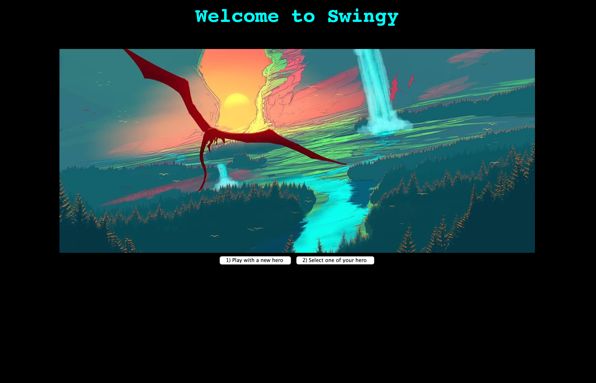
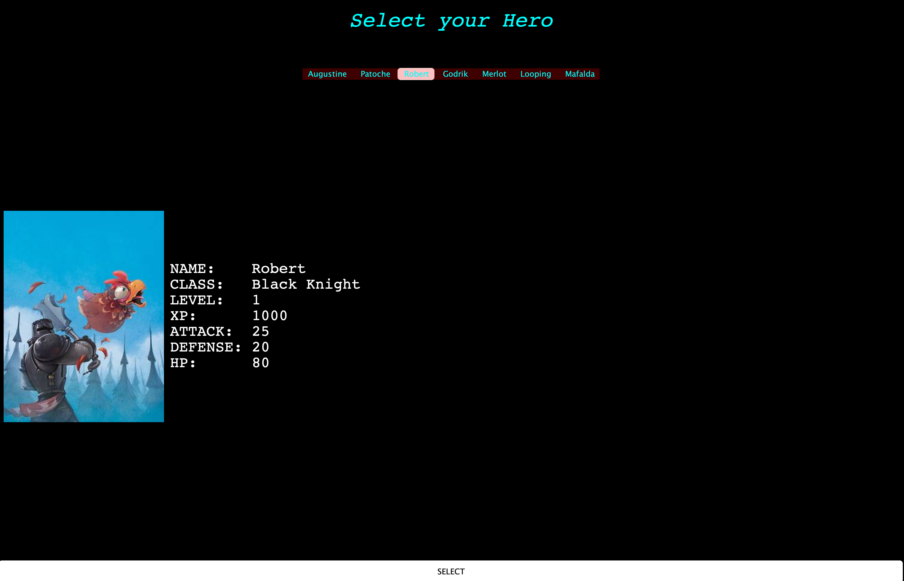
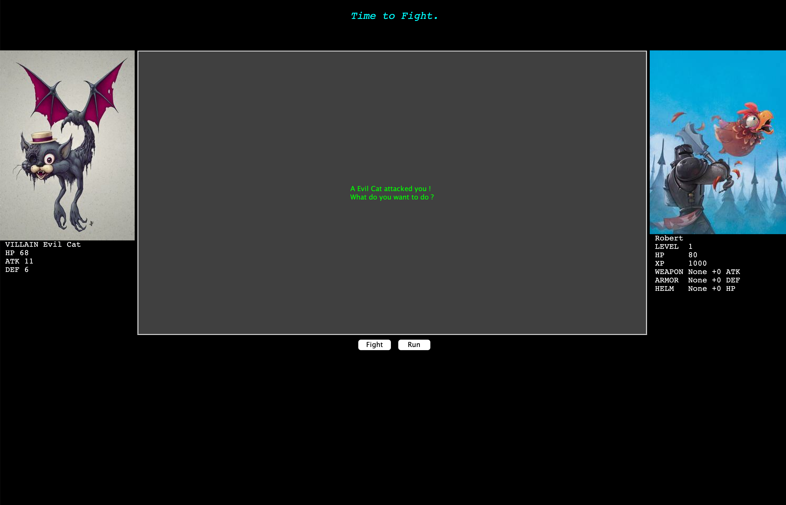
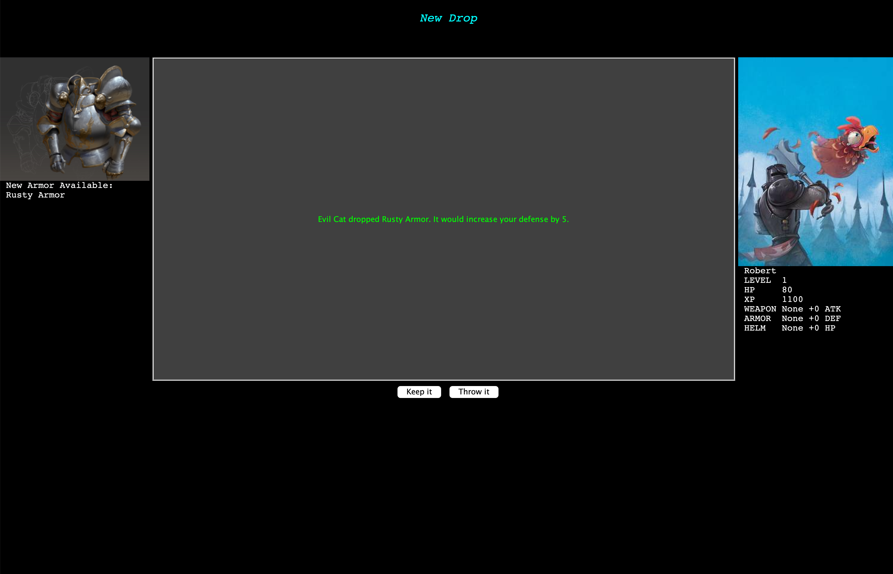
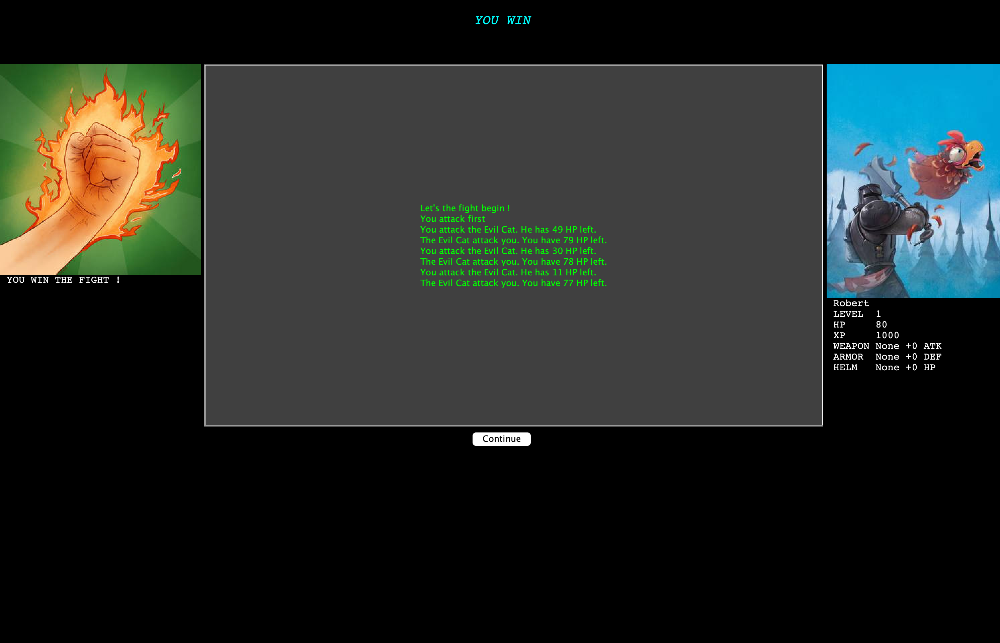
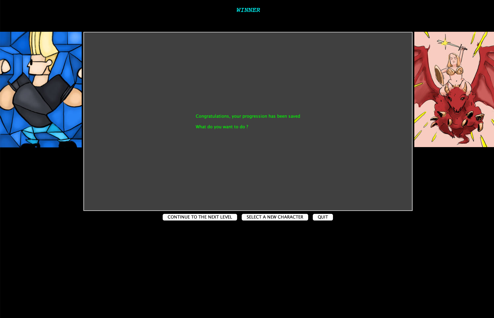
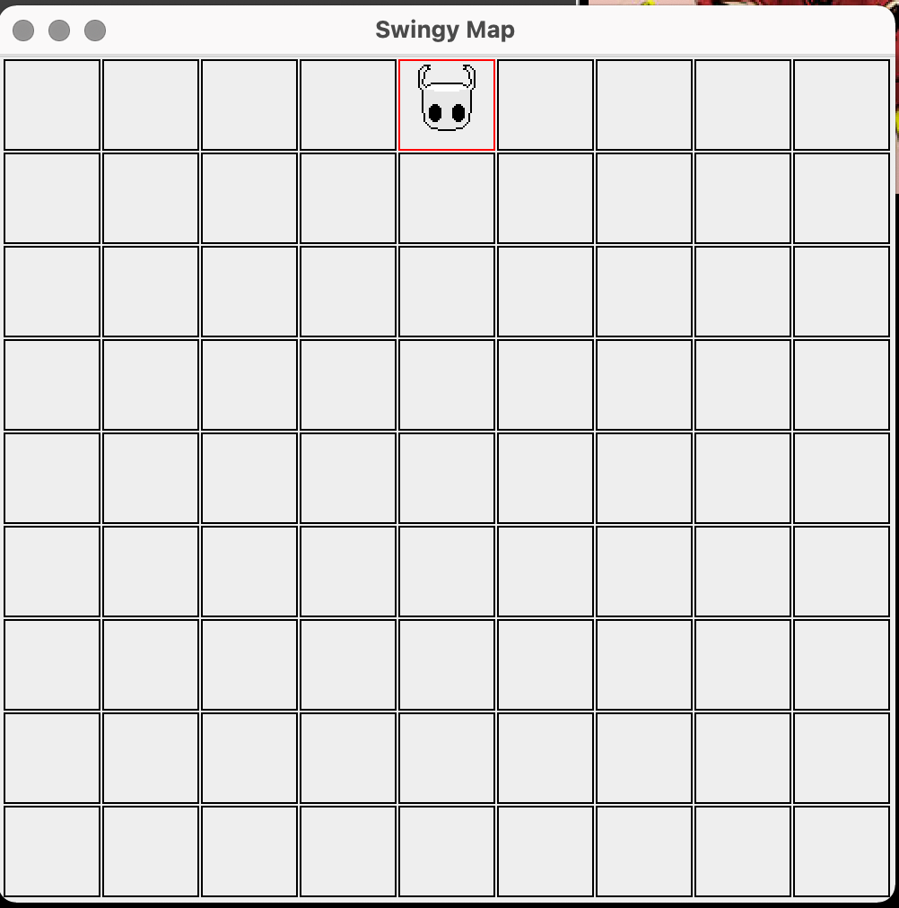

# 🧙‍♂️ Swingy – RPG en Java

## 🎮 Description  
**Swingy** est un jeu de rôle textuel développé en Java avec une interface graphique via le framework **Swing**.  
Ce projet, réalisé dans le cadre de ma formation à l’école 42, m’a permis d’explorer le développement d’applications GUI tout en appliquant les principes de la programmation orientée objet.

🧩 Objectifs :
- Créer un RPG textuel avec une interface graphique (Swing)
- Implémenter deux modes de jeu : **console** et **graphique**
- Gérer la logique de combat, les statistiques de personnages, les équipements et la progression
- Structurer un projet Java avec Maven et une base de données SQLite

<p float="left">







</p>

---

## 🛠️ Stack technique

- **Java 15.0.2**
- **Apache Maven 3.8.1**
- **Swing** – interface graphique
- **SQLite JDBC 3.3** – persistance des données

---

## 🚀 Lancer le projet

### 🔧 Compilation

```
$ cd swingy
$ mvn clean package
```

## 🚀 Comment Jouer

Naviguez jusqu'au dossier target et lancer le jeu dans votre mode préféré:

### ▶️ Mode Console

```
$ java -jar swingy-1.0.jar console
```

### 🖥️ Mode GUI

```
$ java -jar swingy-1.0.jar gui
```

## 🧠 Ce que j'ai appris

- Construire une application Java modulaire avec Maven 
- Créer et gérer des composant GUI sous SWING 
- Gérer les entrées utilisateurs et la logique de jeu
- La persitance des datas avec SQLITE
